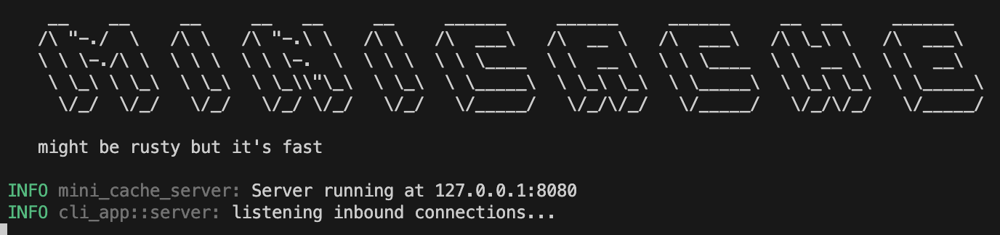

# mini-cache

This project is just a small key value db in Rust.


## Overview 

The project aims to create a client CLI app, and server to interact with the storage.
Python bindings will also be added, to create a python client.

## Running

First run the server by executing the following:
```bash
cargo run --bin mini-cache-server  
```
The server will prompt you the following:



Then run the client CLI:
```bash
cargo run --bin mini-cache-client  
```
And you can now use the storage with the commands shown below.

### Supported Commands

The storage is capable of the following commands:

- SET
    - 
    ```bash
    SET key value
    ```
- GET 
    -
    ```bash
    GET key 
    ```
- DEL
     -
    ```bash
    DEL key 
    ```
- LIST 
     -
    ``` bash
    LIST
    ```

- TTL
     -
    ``` bash
    TTL key
    ```